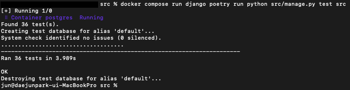

# 소셜미디어 통합 Feed 서비스
<br/>

## Table of Contents
- [개요](#개요)
- [기술스택](#기술스택)
- [설치](#설치)
- [테스트](#테스트)
- [APIs](#APIs)
- [팀원 및 회고](#팀원-및-회고)

  <br/>
## 개요
- 본 서비스는 복수의 SNS에 게시된 게시물을 하나의 서비스에서 확인할 수 있는 통합 Feed 어플리케이션입니다.
- `인스타그램`, `스레드`, `페이스북`, `트위터` 등 사용하고 있는 다양한 SNS에 게시된 게시물을 유저 계정 해시태그 (예, `#dami` ) 또는 특정 해시태그를 기반으로 확인할 수 있습니다.
- 본 서비스의 이용을 원하는 고객은 가입 진행 시 계정, 비밀번호, 이메일 정보를 제공해야 하며, 가입 승인을 위해 이메일로 발송된 코드를 입력하여 가입 승인을 받아야 서비스 이용이 가능합니다.
- 본 서비스의 메뉴는 통합 Feed 단일이며, 조회된 게시물의 제목 및 내용과 관련한 키워드를 검색 할 수 있고, 검색하여 나온 결과를 통해 원하는 게시물들을 조회할 수 있습니다.
- 본 서비스의 고객은 본인의 기호에 따라 게시물에 좋아요를 클릭하여 `view_count` 횟수를 증가 시킬 수 있으며, 해당 횟수는 제한이 없습니다. 또한 게시물 공유가 가능하며 공유 시 `share_count`가 증가하게 됩니다.
- 본 서비스의 고객은 해시태그를 기반으로 일자별, 시간별 게시물 개수 통계를 확인할 수 있습니다. 일자별 조회는 최대 한달(30일)이며, 시간별 조회는 최대 일주일(7일) 조회가 가능합니다.

## 기술스택
### Backend
<br/>
<div align="center">
  
  
  
  
  
</div>

<details>
<summary>Why?</summary>

Django
```
1. 간단한 설정 및 빠른 개발
https://docs.djangoproject.com/ko/4.2/misc/design-philosophies/
장고의 철학 중 하나인 신속한 개발이 포함. 해당 과제를 수행으로
빠른 기능 구현을 위해 사용
2. 강력한 ORM
길어질 수 있는 SQL쿼리를 직접 작성하지 않고 데이터베이스를 조작하기 위해 ORM
을 사용 가능하기에 사용
3. 커뮤니티 활성화
파이썬 프레임워크 커뮤니티 중 가장 거대하고 활성화가 되어있고 자료 검색 용이를
위해 사용
```

DRF(Django Rest Framework)
```
1. RESTfrul API 지원
DRF에서 RESTful API구축하는데 필요한 모든 도구와 기능을 제공
(시리얼라이저, URL, 테스트 API 뷰 등등)
2. 직렬화 및 역질렬화
데이터 모델을 JSON 또는 다른 형식의 데이터로 변환하고 그 역도 가능하도록
도와주는 강력한 직렬화 및 역직렬화 기능을 제공
3. 인증 및 권한 관리
DRF는 사용자 인증 및 권한 관리를 위한 다양한 방법을 제공
```

Docker & Docker-compose
```
배포를 위해서가 아니라 github actions와 데이터베이스(Postgres)를 사용
어느 동일한 개발 환경을 테스트를 위해 격리된 환경을 제공하고 환경 설정할 수 있기에
사용 docker-compose의 경우 두개 이상의 컨테이너가 존재하기에 yaml파일을 정의해서
간단하게 사용 가능하기에 사용
```
</details>

<br/>

### DB

<details>
<summary>Why?</summary>
데이터베이스 변경 이슈

해당 과제에 간단한 CRUD만 된다고 생각하여 기본으로 제공하는 SQLite를 사용하기로 했습니다. 하지만 아래의 문제점, 원인으로 인하여 PostgreSQL를 사용했습니다.
문제점: 통계 API 작성 중에서 날짜 집계 함수를 사용하려고 했습니다. TruncDay라는 함수가 있는데 django.db.utils.OperationalError: user-
defined function raised exception가 발생=
원인: SQLite에서 datetime을 지원하지 않아 함수 사용이 불가

Postgres
```json
1. Djang는 PostgreSQL에서만 작동하는 다양한 데이터 유형을 제공
2. Django에는 PostgreSQL에서 데이터베이스 작업을 수행하기 위한 django.contrib.postgres가 있음

```
- Django공식문서 Postgres

[PostgreSQL 관련 집계 함수](https://docs.djangoproject.com/en/5.0/ref/contrib/postgres/aggregates/)

[PostgreSQL 관련 데이터베이스 제약 조건](https://docs.djangoproject.com/en/5.0/ref/contrib/postgres/constraints/)

[PostgreSQL 관련 양식 필드 및 위젯](https://docs.djangoproject.com/en/5.0/ref/contrib/postgres/forms/)

[PostgreSQL 관련 데이터베이스 기능](https://docs.djangoproject.com/en/5.0/ref/contrib/postgres/functions/)

[PostgreSQL 관련 모델 인덱스](https://docs.djangoproject.com/en/5.0/ref/contrib/postgres/indexes/)

[PostgreSQL 관련 조회](https://docs.djangoproject.com/en/5.0/ref/contrib/postgres/lookups/)

[데이터베이스 마이그레이션 작업](https://docs.djangoproject.com/en/5.0/ref/contrib/postgres/operations/)

[전체 텍스트 검색](https://docs.djangoproject.com/en/5.0/ref/contrib/postgres/search/)

[인덱스](https://docs.djangoproject.com/en/5.0/ref/contrib/postgres/validators/)
</details>
<br/>

### Managements
<div align="center">


</div>
<details>
<summary>Why?</summary>
Git & Github

```json
1. 버전관리
소스 코드를 효과적으로 버전 관리할 수 있는 도구로,
개발자들은 변경 내용을 추적하고 이전 버전으로 되돌릴 수 있음
이를 통해 협업 중 코드 충돌을 방지하고 안정적인 코드베이스를 유지

2. GitHub
Git 저장소를 호스팅하고 협업을 간편하게 할 수 있게 해주는 플랫폼
여러 개발자가 동시에 작업하고 변경 사항을 추적하며 코드 검토 및 이슈 관리를 쉽게 할 수 있음

```

Github Actions

```json
팀 내의 코드 컨벤션, 테스트 코드 작성, 이를 바탕으로 CI를 적용하기 위해서
깃 허브에서 간단한 설정 및 연동이 가능한 github actions를 사용
```
</details>

<br/>

## 설치
docker-compose로 django(어플리케이션)과 postgre(데이터베이스)를 구성합니다.
- docker-compose로 django(어플리케이션)과 postgre(데이터베이스)를 구성하였습니다.

```python
docker compose up # running server to http://127.0.0.1:8000
```

<br/>

## 테스트
- django 컨테이너에서 poetry로 구성하면서 app과 app/src로 구성되며, src의 test를 진행합니다.

```python
docker compose run django poetry run python3 src/manage.py test src/
```



<br/>

## APIs
| 앱 | 기능 | URL | Method | Parameter | Return |
| --- | --- | --- | --- | --- | --- |
| users | 회원 가입 | /users/confirm/ | POST | {email, username, password} | {email, username, confirmcode} |
|  | 가입 승인 | /users/login/ | POST | {username, password, code} | {username, isConfirmed} |
|  | 로그인 | /users/signup/ | POST | {username, password} | {username, token{refresh, access}} |
|  | token 재발급 | /users/token/refresh | POST | {refresh_token} | {access_token} |
| posts | 게시물 리스트 조회 | /posts/ | GET | {limit, offset, type, search, ordering, hastag} | PostList{contentId, postType, title, content, viewCount, likeCount, shareCount, createdAt, updatedAt, hashtag, user} |
|  | 게시물 상세 조회 | /posts/{id} | GET | {content_id} | PostDetail{contentId, postType, title, content, viewCount, likeCount, shareCount, createdAt, updatedAt, hashtag, user} |
|  | 통계 정보 조회 | /posts/statistics | GET | {type, start, end, hashtag, value} | {datetime, count} |
|  | 최근 많이 사용된 해시태그 조회 | /posts/hashtag/recommend | GET |  | {hashtag_id, hashtag_name} |
| likes | 게시물에 좋아요 | /likes/{id} | POST | {content_id} |  |
| shares | 게시물 공유 | /shares/{id} | POST | {content_id} |  |

<br/>

## 팀원 및 회고
<div align="center">

| name | title | profile link | email | review |
|------|-------|--------------|-------|--------|
| 윤성원 | 팀장 | [@lfoyh6591](https://github.com/lfoyh6591) | lfoyh6591@naver.com | https://determined-chamomile-42b.notion.site/835d8c6783a2477499438c07e1a7c125?pvs=4
| 사재혁 | 팀원 | [@saJaeHyukc](https://github.com/saJaeHyukc) | wogur981208@gmail.com | https://determined-chamomile-42b.notion.site/f86b007c44954ab6947dbf2a445ee67f?pvs=4
| 박대준 | 팀원 | [@Chestnut90](https://github.com/Chestnut90) | cowzon90@gmail.com | https://determined-chamomile-42b.notion.site/09b567f9f59747ee86d4074659211a3a?pvs=4
| 이슬기 | 팀원 | [@simseulnyang](https://github.com/simseulnyang) | happysseul627@gmail.com | https://determined-chamomile-42b.notion.site/5491797e84834a26a32a0f8ce58e51d8?pvs=4

</div>
